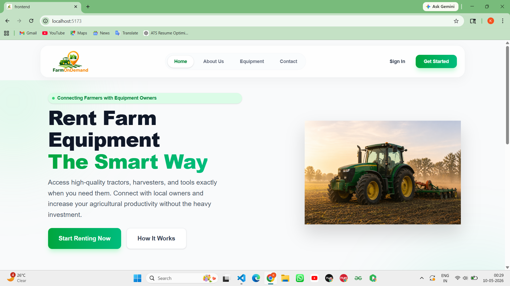
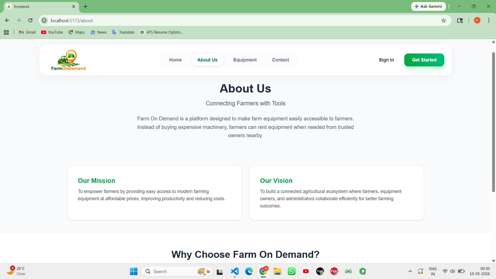
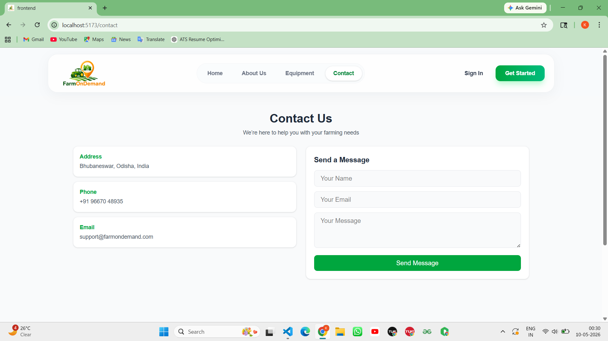
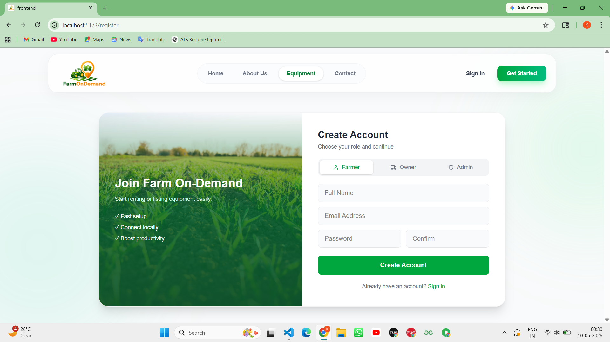
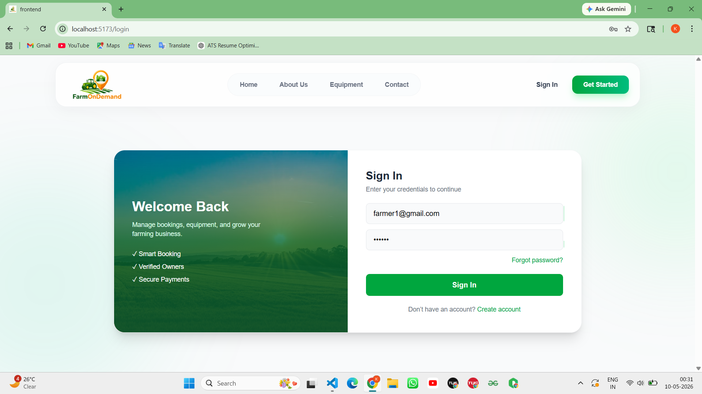
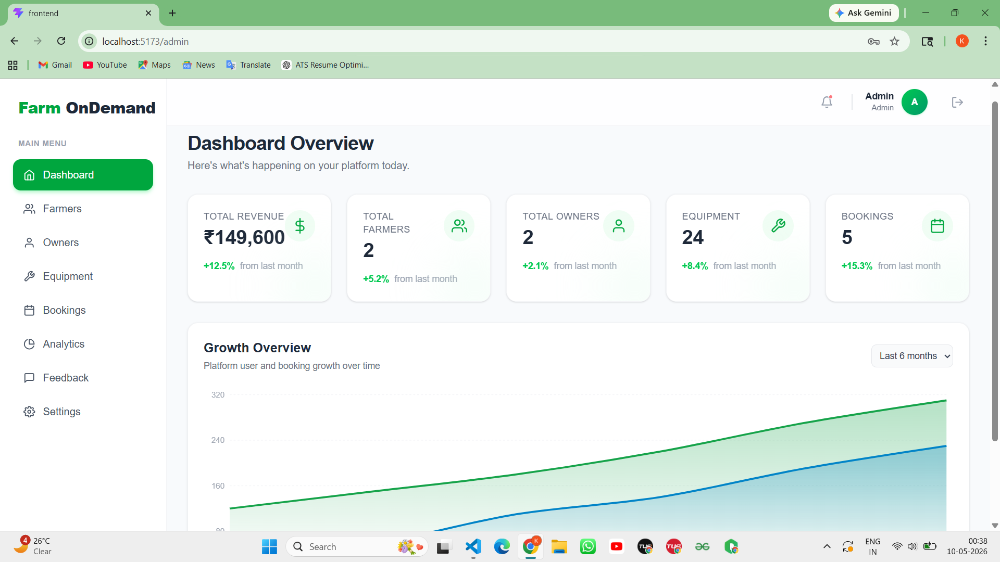
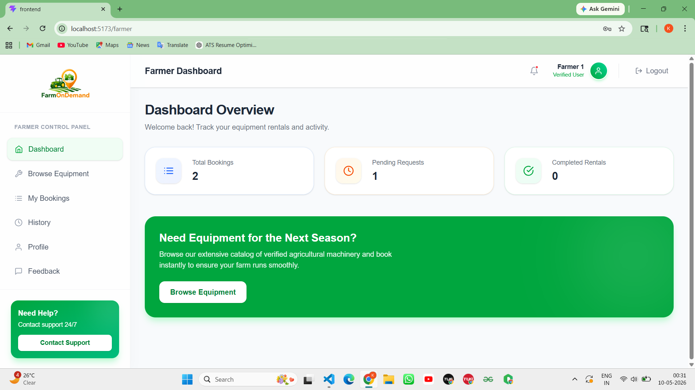
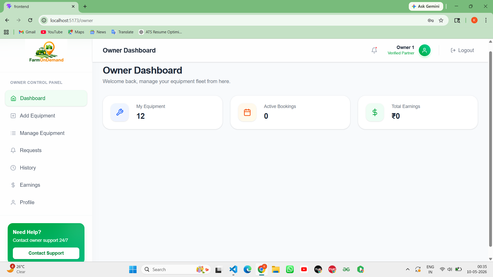

##  Project Overview

**Farm On Demand** is a MERN stack web application that connects **farmers and equipment owners**.  
It allows farmers to rent agricultural machinery easily while enabling owners to manage and list their equipment.

An **Admin panel** is included to manage users, equipment, and system operations.

---

#  Farm On Demand

 **Live Demo:** http://localhost:5173/

---
# Screenshots
## Home Page

## Admin Dashboard

## Farmer Dashboard

## Owner Dashboard

---
##  Objectives

- Provide easy access to farm equipment  
- Reduce cost of farming operations  
- Allow owners to earn from unused machinery  
- Digitize the agricultural rental system  

---

##  System Modules

###  1. Farmer Module

- Register/Login  
- Browse available equipment  
- Search and filter equipment  
- View equipment details  
- Rent equipment  
- View rental history  

 **Role:**  
Farmers act as service users who search, select, and rent agricultural equipment based on their needs. They use the platform to access machinery easily and manage their bookings efficiently.

---

###  2. Owner Module 

- Register/Login  
- Add new equipment  
- Update/Delete equipment  
- Upload equipment images  
- Manage equipment availability  
- View rental requests  
- Accept/Reject requests  
- Dashboard to manage listings  

 **Role:**  
Owners act as service providers who list their equipment for rent. They manage inventory, control availability, and handle rental requests from farmers to generate income from their machinery.

---

### 🛠 3. Admin Module

- Manage users (Farmer & Owner)  
- Approve or remove equipment listings  
- Monitor platform activity  
- Handle disputes and system control  
- Maintain overall system integrity  

 **Role:**  
Admin acts as the system controller who oversees all activities, ensures proper functioning, manages users and data, and maintains security and reliability of the platform.

##  Tech Stack

###  Frontend
- React (Vite)
- Tailwind CSS
- React Router
- Axios

###  Backend
- Node.js
- Express.js
- MongoDB (Atlas)
- Mongoose
- JWT Authentication

